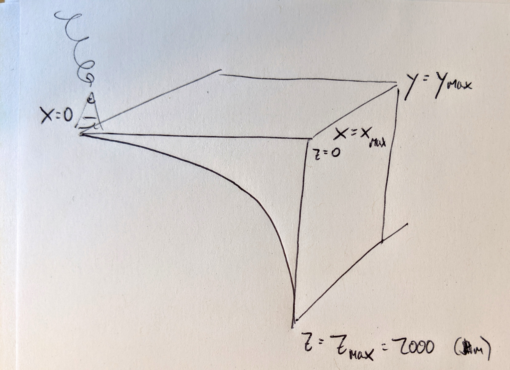

```{r setup, message = FALSE, echo = FALSE}
library(tidyverse)
theme_set(theme_bw())
```


I'm imagining a volume of the Earth's crust like this:

{width=25%}

Note that y is positive into the page and z is positive down.

Magnabosco says that the number of cells per unit volume, as a function of depth, is given by 
$$
\rho = 10^Az^B
$$
Where $\rho$ is the cell concentration along a column and $A$ and $B$ are parameters determined empirically from a linear fit to log-transformed cell data. 

We can find the total number of cells in a column by integrating from $z_{crust}=0$ to $z_{crust}=z_{max}$ (the bottom of the crust),

$$
c_{col} = \int_0^{z_{max}} 10^Az_{crust}^B dz_{crust} 
$$
where $c_{col}$ is the number of cells per unit area in a column. (Magnabosco et al used $\textrm{cells cm}^{-3}$ so this would be the number of cells in a 1 $\textrm{cm}^2$ column of crust.)

The antiderivative of $\rho(z)$ is given by
$$
\int 10^Az_{crust}^Bdz_{crust} = \frac{10^Az_{crust}^{B+1}}{B+1} + C
$$

Note that $0^{B+1} = 0$ for any $B$, so

$$
\begin{aligned}
c_{col}(z_{max}) &= \int_0^{z_{max}} 10^Az^B dz \\
&= \frac{10^Az_{max}^{B+1}}{B+1}
\end{aligned}
$$
OK, cool. Now we need to plug in the expression for $z_{max}$ as a function of distance from the volcanoes.

I've used an exponential function to model the depth of the crust:
$$
z_{crust} = A10^{-kx}
$$
$A$ and $k$ are scaling parameters. This functional form never gets to zero, so for convenience's sake, let's say that the depth of the crust at the volcano is 1. Thus,

$$
z_{crust}(0) = A10^{0} = A \\
A = 0
$$
Then we calculate $k$:
$$
z_{max} = 10^{-kx_{max}} \\
\log z_{max} = -kx_{max} \\
k = \frac{-\log z_{max}}{x_{max}}
$$

So,
$$
z_{crust} = 10^{\frac{x\log z_{max}}{x_{max}}}
$$
Combining everything, 

$$
c_{col} = \int_0^{z_{max}} 10^A\left(10^\frac{x \log z_{max}}{x_{max}} \right)^B dz_{crust} 
$$

Based on literature (**add lit ref!**), $z_{max} = 13,000$ at $x_{max}$. 

In order to get a volume, we need to integrate across the width and length of the volume:

(THis is messed up. I think I am overcomplicating it. See below, where I look at symbolic integration)

$$
c_{vol} = \int_0^{y_{max}} \int_0^{x_{max}} \int_0^{z_{max}} \int_0^{z_{cr}} dz_{crust} dx dy
$$


Let's see if we can use R's symbolic antidifferentiator to handle this mess of an equation.

```{r messages=FALSE}
library(rSymPy)
```
```{r}
z_max = Var("z_max") # Maximum depth of hte crust anywhere, i.e. bottom of the crust at the trench
z_crust = Var("z_crust") # Bottom of the crust at a given distance from the trench
z = Var("z") # Depth within the crust

rho <- Var("rho") # Density of cells (defined as cells cm^-3)
A <- Var("A") # Scaling constant from Magnabosco
B <- Var("B") # Scaling constant from Magnabosco

```
Calculate cell density as a function of depth
```{r}
print(sympy(diff(cos(x), x)))
```


We know from literature that the depth of the crust at the trench is 13 km. 


$\theta$ is a scaling parameter; $\theta = \frac{z_{crust,max}}{\log(x_{max} + 1)}$. We have to express $z_{crust}$ as a function of $x+1$ so that $z_{crust} = 0$ when $x=0$. 

Note that this gives the following profile (assuming 100 km from volcano to the limit of integration):
```{r}
depth.m <- 10000
theta <- depth.m/log10(100+1) # crust is depth.m deep at most

x <- 0:100 # Am using kilometers for x and meters for Z, take note
zmax <- theta*log10(-1*x+1)
d <- data.frame(x, zmax)

ggplot(d, aes(x=x, y=zmax)) + 
  geom_line() + 
  scale_y_reverse() + 
  scale_x_reverse() +
  xlab("x (distance from volcano), km") + 
  ylab("zmax (max depth of crust), m")
```

We can integrate over $x$ (left-to-right across the page) to get the number of cells in a unit of cross-sectional area of crust.

$$
\begin{aligned}
c_{area} &= \int_0^{x_{max}}c_{col}(x) dx \\
&= \int_0^{x_{max}}\int_0^{z_{crust}}10^Az^Bdzdx \\
&= \int_0^{x_{max}}\frac{10^Az_{crust}^{B+1}}{B+1}dx \\
&=\frac{10^Az_{crust}^{B+2}}{(B+1)(B+2)}|_{x_{max}} - \frac{10^Az_{crust}^{B+2}}{(B+1)(B+2)}|_0 \\
&= \frac{10^A \theta \log(x_{max} + 1)^{B+2}}{B^2 + 3B + 2}
\end{aligned}
$$


This gives a number of cells per cross-sectional area of the volume we want to consider. To get the actual population of cells $\textrm{pop}$, we multiply by the width of the volume $y_{max}$:
$$
\textrm{pop} = y_{max}\frac{10^A \theta \log(x_{max} + 1)^{B+2}}{B^2 + 3B + 2}
$$

Magnabosco has $A = 8.16 (8.00, 8.45)$ and $B = -0.94 (-1.01,-0.81)$ so for a max depth of `r depth.m/1000` m, a max volcano-to-outer-arc length of 100,000 m and a width of 100,000 m
```{r}
A <- 8.16
B <- -0.94
calc_theta <- function(z_max, x_max) {
  theta <- z_max / log10(x_max + 1)
  theta
}
#theta <- calc_theta(z_max = depth.max, x_max = 10^5)
calc_cells <- function(x_max, y_max, theta, A = 8.16, B = -0.94) {
  pop <- y_max * (10^A * theta * log10(x_max + 1) ^ (B+2)) / (B^2 + 3*B + 2)
  pop
}
num.cells <- calc_cells(x_max = 1e5, y_max = 1e5, theta = theta, A = 8.16, B = -0.94)
num.cells
```
This seems like a plausible number?

There may well be an error or two in these calculations; I'll want to go over them a bit. But I think this is basically the right approach.

## Note on error

There is one big problem with the Magnabosco parameters: you can't calculate $\int_0^{z_max}10^Az^B$ when $B<=-1$. The integral does not converge, since $0^-1 = \frac{1}{0}$. That's not really anyone's fault, it's just that Magnabosco used a model that yields impossible error as depth approaches 0. So... we can't use those data to calculate error. We could recalculate the power law slopes or recalculate the error bounds but we can't use the Magnabosco model as is.

# Checking my math

Above, plugging in 10 km for max depth, and a distance of 100 km trench-to-volcano and a width of 100 km (arbitrarily), I get 5e17 cells. 

Let's try a simpler calculation to see whether I get 